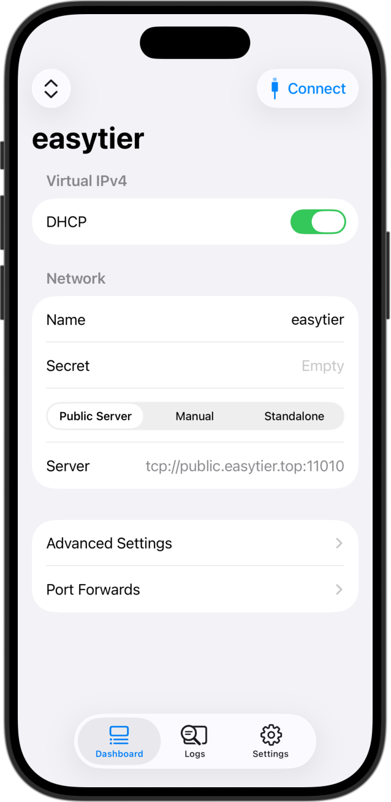
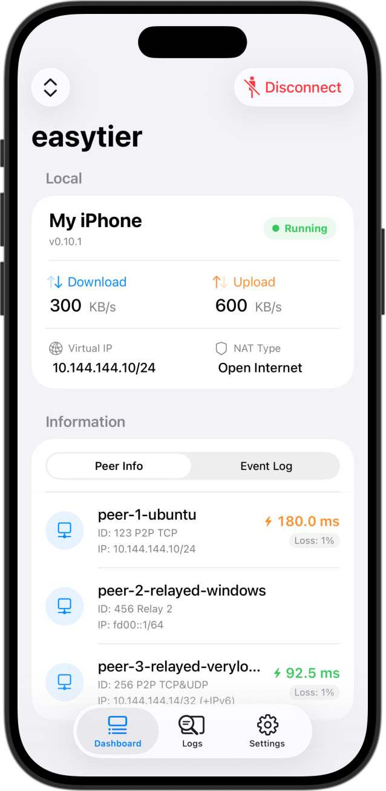

# EasyTier iOS 客户端

[简体中文](README_CN.md) | [English](README.md)

iOS 版 EasyTier 原生客户端，适用于去中心化虚拟专用网络解决方案。

### 概览

这是 EasyTier 的 iOS 客户端，提供友好的界面以在 iOS 设备上连接 EasyTier 网络，并使用 Network Extension 框架实现系统级 VPN 集成。

### 截图

### 安装

暂未提供安装包。

### 许可证

GNU General Public License v3.0 - 详见 [LICENSE](LICENSE)

### 项目链接

- EasyTier: [EasyTier/EasyTier](https://github.com/EasyTier/EasyTier)
